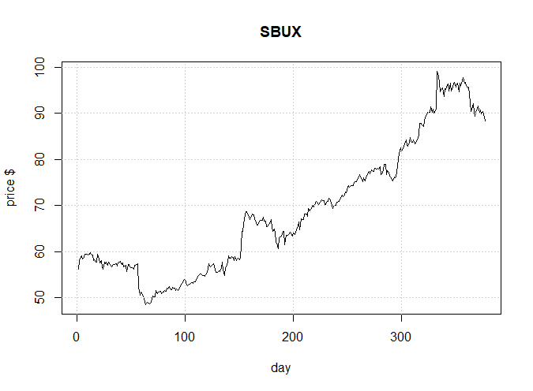
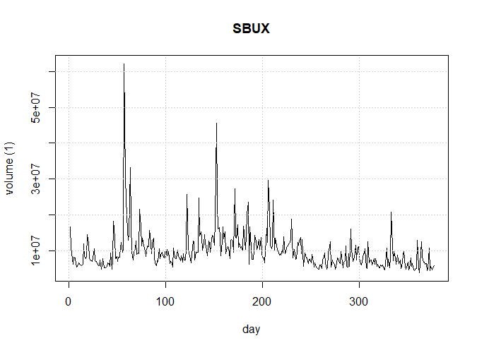

# Introduction
This is an implementation of a support vector machine designed to identify short-term stock price changes, based on previous stock parameters: open, low, high, close, volume

## Stock selected for this exercise:

I chose to use Starbucks stock becuase I have written a repot on this corporation in Managerial Economics. Please see the following graphs:

```{r echo=FALSE, out.width='100%'}

```

This graph shows a aconstant increase in the stockprice value.

```{r echo=FALSE, out.width='100%'}

```

This graph shows a aconstant, low level of volatility. 

```{r setup, echo=FALSE, include=FALSE}
knitr::opts_chunk$set(echo = TRUE)
library(e1071)
```

## get data:

```{r}
SBUXData = read.csv('SBUX.csv')
View(SBUXData)

```

Names of the variables in the data set: 
price.open,	price.high,	price.low,	price.close,	volume,	price.adjusted,	ref.date'	ticker'	ret.adjusted.prices,	ret.closing.prices'	pctChange.	changeCategory

# set up data frame
```{r}
    SBUXDataFrame = data.frame(open=SBUXData$price.open, high=SBUXData$price.high, low=SBUXData$price.low, close=SBUXData$price.close,volume= SBUXData$volume/10000, 
      change = SBUXData$changeCategory )

# look at top and bottom..
head(SBUXDataFrame)
tail(SBUXDataFrame)
remove(SBUXData)
```

```{r}
levels(SBUXDataFrame$change)
plot(SBUXDataFrame)
```


## classification model, categorical response

### traditional interface:
```{r}
x <- subset(SBUXDataFrame[1:366,], select = -change)
y <- SBUXDataFrame[1:366,]$change
model1 <- svm(x, y) 

#model1 is all the data
print(model1)
summary(model1)
```


## how well did the model fit?

```{r}
pred <- predict(model1, x)

# Check accuracy:
table(pred, y)
```

## decision values

```{r}
# compute decision values and probabilities:
pred <- predict(model1, x, decision.values = TRUE)
attr(pred, "decision.values")[1:6,]

# visualize (classes by color, SV by crosses):
plot(cmdscale(dist(SBUXDataFrame[,-6])),
     col = as.integer(SBUXDataFrame[,6]),xlab="normalized X", ylab = "weitghted change",
     pch = c("o","+")[1:150 %in% model1$index + 1])
legend('bottomleft',c('data','prediction'),pch=c('0','+'))
grid()

     
```


# train and test set:


```{r}
pctTrain=0.70 # use 70% of the data
#nObs = length(x[,1])
nObs = 366
nTrain = round(pctTrain*nObs,0)

# next line take data in order
#TrainSetIndex = 1:nTrain

#These lineas are a random sample
scramble = sample (1:nObs)
TrainSetIndex = scramble[1:nTrain]
TestSetIndex = scramble[(nTrain+1):nObs]
```

## set up training set, test set

```{r}
# first the training set

SBUXDataFrame1 = SBUXDataFrame[1:366,]

XtrainSet = SBUXDataFrame1[TrainSetIndex,-6]
YtrainSet = SBUXDataFrame1$change[TrainSetIndex]
```

## get the model from training set.. 

This is model2

```{r}
model2 <- svm(XtrainSet, YtrainSet) 

print(model2)
summary(model2)
```

## now the test set.. 
now see how model2 does on the training set

```{r}
XtestSet = SBUXDataFrame[(nTrain:nObs),-6]
YtestSet = SBUXDataFrame1$change[nTrain:nObs]
```

## and evaluate with the test data

```{r}
pred2 <- predict(model2, XtestSet)
# And the accuracy..

table(pred2, YtestSet)
```

## tune

```{r}
stockTuned <- tune.svm(XtrainSet, YtrainSet, gamma = 2^(-2:1), cost = 2^(1:4))

summary(stockTuned)
plot(stockTuned)
print(paste('best parameters: gamma=',stockTuned$best.parameters[1], ', cost=', stockTuned$best.parameters[2]))
```

```{r}
#use optimized parameters... 
model3 <- svm(XtrainSet, YtrainSet, gamma=as.numeric(stockTuned$best.parameters[1]), cost=as.numeric(stockTuned$best.parameters[2] )) 

print(model3)
summary(model3)
```

```{r}


pred3 <- predict(model3, XtestSet)
# And the accuracy..

table(pred3, YtestSet)

```

Use the last 5 values to see how we do

```{r}

XtestSetFortheMoney = SBUXDataFrame[367:371,-6]
YtestSetFortheMoney  = SBUXDataFrame[367:371,6]

pred4 <- predict(model3, XtestSetFortheMoney)
# And the accuracy..
print(pred4)
#table(pred4, YtestSetFortheMoney)
```

THe actual 5 days were Even, Even, Even, Even, Loss

```{r}
# compute decision values and probabilities:
pred <- predict(model3, XtestSet, decision.values = TRUE)
attr(pred, "decision.values")[1:6,]
# visualize (classes by color, SV by crosses):
plot(cmdscale(dist(XtestSet)),
     col = as.integer(YtestSet),xlab="normalized X", ylab = "weighted  change",
     pch = c("o","+")[1:150 %in% model3$index + 1])
legend('bottomright',c('data','prediction'),pch=c('0','+'))
grid()
```


# SVM assignment

## complete an rmarkdown file on the stock you selected.   
  You will turn in the URL for your github accout that has the repo for this assignment.

### Identify the stock you use for this assignment.  
  Why did you choose this particular stock?  I thought it had variability.


<!--   Include in your final report a graph of the stock closing price over the period 20 Jan 2018 to 13 Sept 2019.  Include the .csv file in your repo for the stock you selected.  !-->

### Use this template to get the SVM:  

  1. Training and Test sets:    
<!--    What percent of the stock data did you use for the training set?  How did you select the training set size?  
    Did you select the training set to be the chronological first data observations, and the test set to be the following observations, or did you choose to randomly sample the stock data to get the training set and use the remaining observations for the test set?  Justification for your choice? !-->  
    
    I used 70% of the data for the training set.
    I selescted the training set using a random sample.
    
    
  2. How well did the SVM do?  
<!-- show the table of predicted vs truth for the whole data set, and then the same table for predicted vs actual results for just the test set.  !-->

The final model predicted 4 of the 5 days

  3. Tune the algorithm- i.e. find optimal gamma and cost values.  <!--Use these valuse to recompute the table of predicted vs actual results for the test set. !-->

### Evaluate SVM performance     

  1. Did you exmine using other than the 'open', 'low', 'high', 'close' prices and volume as predictors? 
  
  I did not
  <!-- do you have any evidence that some particular set of the explanatory variables can improove predictions? !-->
  
  2. Use the SVM you developed to predict stock moves on 16 - 20 Sept. 2019.  Compute the ROI assuming the SVM identifies an opportunity, (for example use around $1000 on each of the SVM predictions)
<!-- There are 5 days available for prediction; if the daily prediction was 'U' buy the stock, then cash out when/if price increases within 5 days. If the daily predictions is 'D', sell the shock short and cash out within 5 days.  If the prediction is E, no investment.  Include your ROI results !-->  
  
  In the first 4 days I broke even, on the fith day I lost money.
  
  3.  Would you put your own $$ in this SVM?
  
  No I would not.
    
  